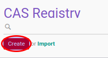

# Membuat Data CAS Registry

1. Buka menu **Product -> Configuration -> CAS Information -> CAS Registry**
2. Klik tombol **Create** pada bagian atas-kiri form.

3. Isi **[CAS Registry](./penjelasan.md#field-name)**. Harus diisi.
4. Isi **[Code](./penjelasan.md#field-code)**. Harus Diisi
5. Ubah **[Active](./penjelasan.md#field-active)** jika dibutuhkan.
6. isi **[Description](./penjelasan.md#field-description)**. Tidak harus diisi
7. Klik tombol **Save** pada bagian atas-kiri form.

