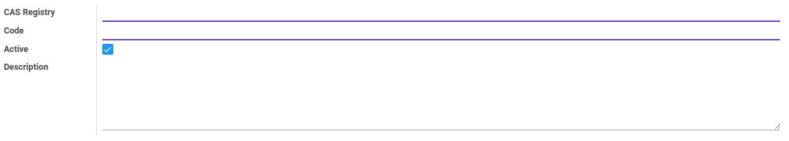

# Penjelasan
> **Catatan:** (Inggris: *Chemical Abstracts Service* registry disingkat CAS Registry)

### <a name="bagian-header">HEADER</a>

#### <a name="field-name">CAS Registry</a>

Mendefinisikan nomor *CAS*

#### <a name="field-code">Code</a>

Kode *CAS*

#### <a name="field-active">Active</a>

Sebagai penanda apakah data adalah aktif/non-aktif

#### <a name="field-description">Description</a>

Deskripsi
