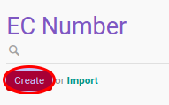

# Membuat Data EC Number

1. Buka menu **Product -> Configuration -> EC Information -> EC Number**
2. Klik tombol **Create** pada bagian atas-kiri form.

3. Isi **[EC Number](./penjelasan.md#field-name)**. Harus diisi.
4. Isi **[Code](./penjelasan.md#field-code)**. Harus Diisi
5. Pilih **[Category](./penjelasan.md#field-category-id)**. Harus diisi.
6. Ubah **[Active](./penjelasan.md#field-active)** jika dibutuhkan.
7. isi **[Description](./penjelasan.md#field-description)**. Tidak harus diisi
8. Klik tombol **Save** pada bagian atas-kiri form.

