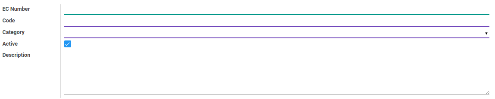

# Penjelasan
> **Catatan:** (Inggris: *European Community* number disingkat EC number)

### <a name="bagian-header">HEADER</a>

#### <a name="field-name">EC Number</a>

Mendefinisikan *EC Number*

#### <a name="field-code">Code</a>

Kode *EC Number*

#### <a name="field-category-id">Category</a>

Mendefinisikan kategori *EC Number*

#### <a name="field-active">Active</a>

Sebagai penanda apakah data adalah aktif/non-aktif

#### <a name="field-description">Description</a>

Deskripsi
