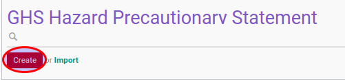

# Membuat Data Hazard Precautionary Statement

1. Buka menu **Product -> Configuration -> GHS Hazard Information -> Hazard Precautionary Statement**
2. Klik tombol **Create** pada bagian atas-kiri form.

3. Isi **[Hazard Precautionary Statement](./penjelasan.md#field-name)**. Harus diisi.
5. Isi **[Code](./penjelasan.md#field-code)**. Harus Diisi
6. Ubah **[Active](./penjelasan.md#field-active)** jika dibutuhkan.
7. isi **[Description](./penjelasan.md#field-description)**. Tidak harus diisi
8. Klik tombol **Save** pada bagian atas-kiri form.

