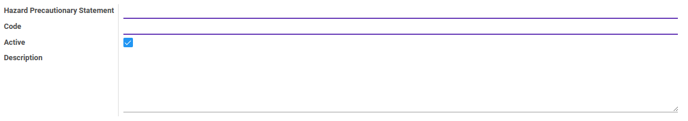

# Penjelasan

### <a name="bagian-header">HEADER</a>

#### <a name="field-name">Hazard Precautionary Statement</a>

Mendefinisikan *Hazard Precautionary Statement*(pernyataan pencegahan bahaya)

#### <a name="field-code">Code</a>

Kode *Hazard Precautionary Statement*

#### <a name="field-active">Active</a>

Sebagai penanda apakah data adalah aktif/non-aktif

#### <a name="field-description">Description</a>

Deskripsi

