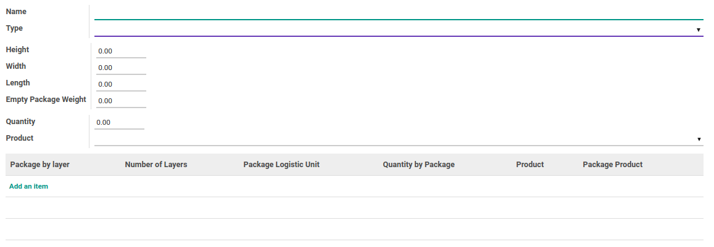

# Logistics Unit

### <a name="bagian-header">HEADER</a>

#### <a name="field-name">Name</a>

Nama unit logistik

#### <a name="field-type">Type</a>

Tipe unit logistik

#### <a name="field-height">Height</a>

Mendefinisikan tinggi unit logistik

#### <a name="field-width">Width</a>

Mendefinisikan lebar unit logistik

#### <a name="field-length">Length</a>

Mendefinisikan panjang unit logistik

#### <a name="field-weight">Empty Package Weight</a>

Mendefinisikan berat unit logistik

#### <a name="field-ul-qty">Quantity</a>

Mendefinisikan kuantitas unit logistik

#### <a name="field-product">Product</a>

Mendefinisikan produk unit logistik

#### <a name="field-package-by-layer">Package by layer</a>

Todo

#### <a name="field-number-by-layer">Number of layers</a>

Todo

#### <a name="field-package-logistic-unit">Package Logistic Unit</a>

Todo

#### <a name="field-qty-by-package">Quantity by Package</a>

Todo

#### <a name="field-product-id">Product</a>

Todo

#### <a name="field-package-product-id">Package Product</a>

Todo