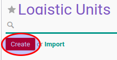

# Membuat Data Logistics Unit

1. Buka menu **Product -> Configuration -> Product Categories & Attributes -> Logistic Units**
2. Klik tombol **Create** pada bagian atas-kiri form.

3. Isi **[Name](./penjelasan.md#field-name)**. Harus diisi.
4. Pilih **[Type](./penjelasan.md#field-type)**. Harus diisi.
5. Ubah **[Height](./penjelasan.md#field-height)** jika dibutuhkan.
6. Ubah **[Width](./penjelasan.md#field-width)** jika dibutuhkan.
7. Ubah **[Length](./penjelasan.md#field-length)** jika dibutuhkan.
8. Ubah **[Empty Package Weight](./penjelasan.md#field-weight)** jika dibutuhkan.
9. Ubah **[Quantity](./penjelasan.md#field-field-ul-qty)** jika dibutuhkan.
10. Pilih **[Product](./penjelasan.md#field-product)**. Tidak harus diisi.
11. Untuk pengisian **Detail Package**, klik tombol **Add an item**
12. Isi **[Package by layer](./penjelasan.md#field-package-by-layer)**.
13. Isi **[Number of layers](./penjelasan.md#field-number-by-layer)**.
14. Isi **[Package Logistic Unit](./penjelasan.md#field-package-logistic-unit)**.
15. Isi **[Quantity by Package](./penjelasan.md#field-qty-by-package)**.
16. Isi **[Product](./penjelasan.md#field-product-id)**.
17. Isi **[Package Product](./penjelasan.md#field-package-product-id)**.
18. Klik tombol **Save** pada bagian atas-kiri form.

