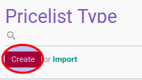

# Membuat Data Pricelist Type

1. Buka menu **Product -> Configuration -> Pricelist -> Pricelist Types**
2. Klik tombol **Create** pada bagian atas-kiri form.

3. Isi **[Name](./penjelasan.md#field-name)**. Harus diisi.
4. Isi **[Key](./penjelasan.md#field-key)**. Harus diisi
5. Klik tombol **Save** pada bagian atas-kiri form.

