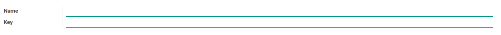

# Penjelasan

### <a name="bagian-header">HEADER</a>

#### <a name="field-name">Name</a>

Nama tipe pricelist/daftar harga

#### <a name="field-key">Key</a>

Kode/Nilai unik untuk tipe pricelist/daftar harga
