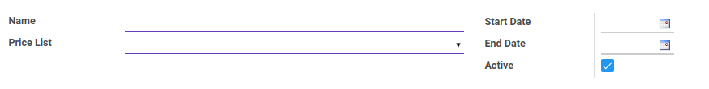
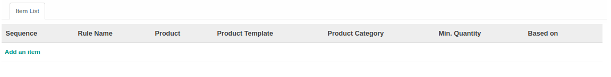
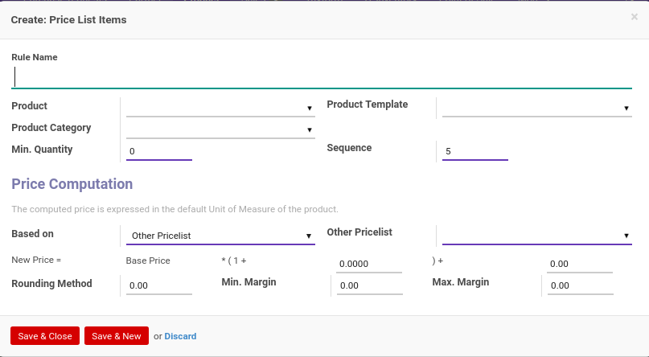
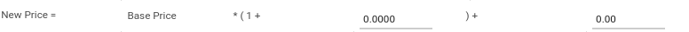

# Pricelist Version

### <a name="bagian-header">HEADER</a>

#### <a name="field-name">Name</a>

Nama versi *Pricelist*(daftar harga)

#### <a name="field-pricelist-id">Price List</a>

Mendefinisikan *Pricelist*(daftar harga)

#### <a name="field-date-start">Start Date</a>

Tanggal valid dimulainya versi *Pricelist*(daftar harga)

#### <a name="field-date-end">End Date</a>

Tanggal valid berakhirnya versi *Pricelist*(daftar harga)

#### <a name="field-active">Active</a>

Sebagai penanda apakah data adalah aktif/non-aktif

### <a name="bagian-header">DETAIL ITEM LIST</a>

#### <a name="field-detail-item-list-name">Rule Name</a>

Nama *Rule*(Aturan)

#### <a name="field-detail-item-list-product-id">Product</a>

Mendefinisikan produk yang akan digunakan

#### <a name="field-detail-item-list-product-categ-id">Product Category</a>

Mendefinisikan kategori produk yang akan digunakan

#### <a name="field-detail-item-list-product-tmpl-id">Product Template</a>

Mendefinisikan template produk yang akan digunakan

#### <a name="field-detail-item-list-min-quantity">Min. Quantity</a>

Mendefinisikan minimum kuantiti

#### <a name="field-detail-item-list-sequence">Sequence</a>

No. Urut

#### <a name="field-detail-item-list-base">Based on</a>

Mendefinisikan berdasarkan apa versi *Pricelist*(Daftar Harga) akan dihitung. *Based on* dibagi atas 4, yaitu: 
* Public Price
* Cost Price
* Other Pricelist
* Supplier Prices on the product form

#### <a name="field-detail-item-list-base-pricelist-id">Other Pricelist</a>

Mendefinisikan *Other Pricelist*.

> **Catatan:** Isian *Other Pricelist* akan muncul apabila nilai *Based On* yang dipilih adalah *Other Pricelist*

#### <a name="field-detail-item-list-formula">Formula</a>

Formula perhitungan untuk harga

#### <a name="field-detail-item-list-price-round">Rounding Method</a>

Mendefinisikan format/metode pembulatan

#### <a name="field-detail-item-list-price-min-margin">Min. Margin</a>

Mendefinisikan minimal margin

#### <a name="field-detail-item-list-price-max-margin">Max. Margin</a>

Mendefinisikan maksimum margin