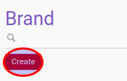

# Membuat Data Product Brand

1. Buka menu **Product -> Configuration -> Product Categories & Attributes -> Product Brand**
2. Klik tombol **Create** pada bagian atas-kiri form.

3. Unggah gambar **[Image](./penjelasan.md#field-image)**.
4. Isi **[Brand Name](./penjelasan.md#field-name)**. Harus diisi.
5. Pilih **[Partner](./penjelasan.md#field-partner-id)**. Tidak harus diisi
6. isi **[Description](./penjelasan.md#field-description)**. Tidak harus diisi
7. Klik tombol **Save** pada bagian atas-kiri form.

