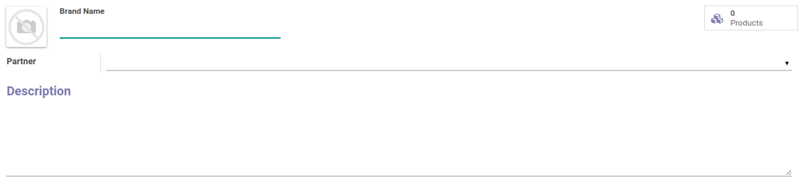

# Penjelasan

### <a name="bagian-header">HEADER</a>

#### <a name="field-image">Image</a>

 
Foto/gambar brand produk

#### <a name="field-name">Brand Name</a>

Nama brand produk

#### <a name="field-partner-id">Partner</a>

Partner brand produk

#### <a name="field-description">Description</a>

Deskripsi
