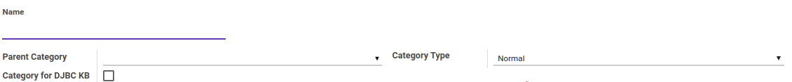
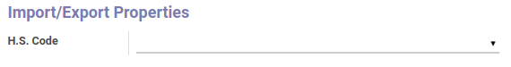
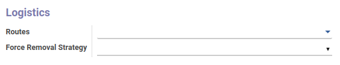
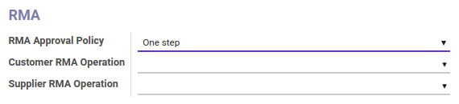
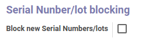
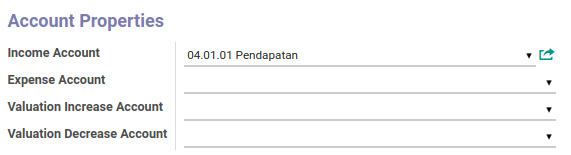
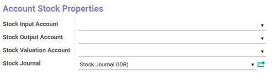
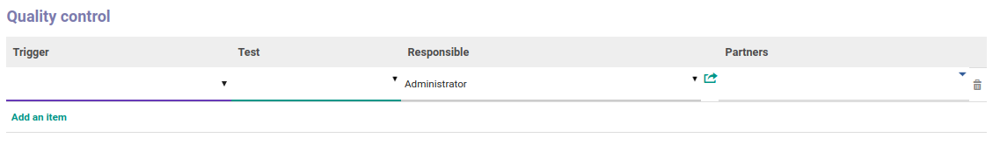

# Penjelasan

Informasi pada Kategori Produk dibagi menjadi beberapa area, diantaranya:

* [Header](#bagian-header)
* [Import/Export Properties](#form-import-export-properties)
* [Logistics](#form-logistics)
* [RMA](#form-rma)
* [Serial Number/lot blocking](#form-serial-number)
* [Account Properties](#form-account-properties)
* [Account Stock Properties](#form-account-stock-properties)
* [Quality control](#form-quality-control)

### <a name="bagian-header">HEADER</a>

#### <a name="field-name">Name</a>

Nama kategori produk

#### <a name="field-parent-id">Parent Category</a>

Parent/Induk dari kategori produk

#### <a name="field-type">Category Type</a>

Tipe kategori. Terbagi atas 2 tipe, yaitu: 
* **Normal**
* **View**

### <a name="form-import-export-properties">Import/Export Properties</a>

#### <a name="field-hs-code-id">H.S. Code</a>

Nomor kode *Harmonized System*(HS)

### <a name="form-logistics">Logistics</a>

#### <a name="field-route-ids">Routes</a>

Todo

#### <a name="field-removal-strategy-id">Force Removal Strategy</a>

Todo

### <a name="form-rma">RMA</a>

#### <a name="field-rma-approval-policy">RMA Approval Policy</a>

Mendefinisikan aturan yang akan digunakan untuk melakukan *Approval*(Persetujuan) RMA. Terbagi atas 2 aturan, yaitu: 
* **One Step**
* **Two Step**

#### <a name="field-rma-customer-operation-id">Customer RMA Operation</a>

Todo

#### <a name="field-rma-supplier-operation-id">Supplier RMA Operation</a>

Todo

### <a name="form-serial-number">Serial Number/lot blocking</a>

#### <a name="field-lot-default-lock">Block new Serial Numbers/lots</a>

Todo

### <a name="form-account-properties">Account Properties</a>

#### <a name="field-property-account-income-categ">Income Account</a>

Mendefinisikan akun *Income Account*

#### <a name="field-property-account-expense-categ">Expense Account</a>

Mendefinisikan akun *Expense Account*

#### <a name="field-property-inventory-revaluation-increase-account-categ">Valuation Increase Account</a>

Mendefinisikan akun *Valuation Increase Account*

#### <a name="field-property-inventory-revaluation-decrease-account-categ">Valuation Decrease Account</a>

Mendefinisikan akun *Valuation Decrease Account*

### <a name="form-account-stock-properties">Account Stock Properties</a>

#### <a name="field-property-stock-input-account-categ">Stock Input Account</a>

Mendefinisikan akun *Stock Input Account*

#### <a name="field-property-stock-output-account-categ">Stock Output Account</a>

Mendefinisikan akun *Stock Output Account*

#### <a name="field-property-stock-valuation-account-id">Stock Valuation Account</a>

Mendefinisikan akun *Stock Valuation Account*

#### <a name="field-property-stock-journal">Stock Journal</a>

Mendefinisikan akun *Stock Journal*

### <a name="form-quality-control">Quality control</a>

#### <a name="field-trigger">Trigger</a>

Todo

#### <a name="field-test">Test</a>

Todo

#### <a name="field-qc-trigger">Responsible</a>

User yang bertanggung jawab atas *Quality Control*

#### <a name="field-partner-id">Partners</a>

Mendefinisikan *Partner*
