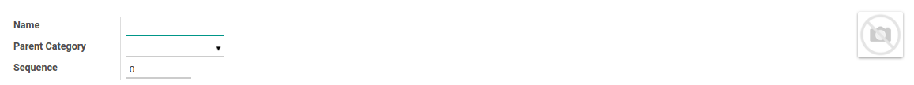

# Public Product Category

### <a name="bagian-header">HEADER</a>

#### <a name="field-name">Name</a>

Nama kategori produk publik

#### <a name="field-image">Image</a>

 
Foto/gambar kategori produk publik

#### <a name="field-parent-id">Parent Category</a>

Parent/induk kategori produk publik

#### <a name="field-sequence">Sequence</a>

No. Urut
