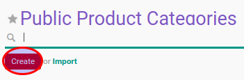

# Membuat Data Public Product Category

1. Buka menu **Product -> Configuration -> Product Categories & Attributes -> Public Product Category**
2. Klik tombol **Create** pada bagian atas-kiri form.

3. Isi **[Name](./penjelasan.md#field-name)**. Harus diisi.
4. Unggah gambar **[Image](./penjelasan.md#field-image)**.
5. Pilih **[Parent Category](./penjelasan.md#field-parent-id)**. Tidak harus diisi
6. Ubah **[Sequence](./penjelasan.md#field-sequence)** jika dibutuhkan.
7. Klik tombol **Save** pada bagian atas-kiri form.

