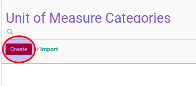
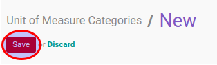

# Membuat Data UoM Category

1. Buka menu **Product -> Configuration -> Unit of Measure -> Unit of Measure Category**
2. Klik tombol **Create** pada bagian atas-kiri form.

3. Isi **[Name](./penjelasan.md#field-name)**. Harus diisi.
4. Klik tombol **Save** pada bagian atas-kiri form.

