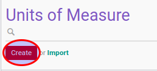

# Membuat Data UoM

1. Buka menu **Product -> Unit of Measure -> Unit of Measure**
2. Klik tombol **Create** pada bagian atas-kiri form.

3. Pilihlah **[Unit of Measure](./penjelasan.md#field-name)**. Harus diisi.
4. Pilihlah **[Unit of Measure Category](./penjelasan.md#field-category-id)**. Harus diisi.
5. Ubah **[Type](./penjelasan.md#field-uom-type)** jika dibutuhkan. Harus diisi
6. Ubah **[Active](./penjelasan.md#field-active)** jika dibutuhkan.
7. Ubah **[Rouding Precision](./penjelasan.md#field-rounding)** jika dibutuhkan. Harus diisi.
8. Klik tombol **Save** pada bagian atas-kiri form.

