# Penjelasan

Informasi pada Product Template dibagi menjadi beberapa area, diantaranya:

* [Header](#bagian-header)
* [Tab Information](#bagian-information)
* [Tab Extra Categories](#bagian-extra-categories)
* [Tab Procurement](#bagian-procurement)
* [Tab Inventory](#bagian-inventory)
* [Tab Sales](#bagian-sales)
* [Tab Variants](#bagian-variants)
* [Tab Accounting](#bagian-accounting)
* [Tab Hazard Information](#bagian-hazard-information)
* [Tab Packaging](#bagian-packaging)

### <a name="bagian-header">HEADER</a>

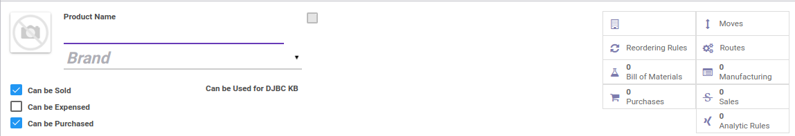

#### <a name="field-image">Image</a>

 
Foto/gambar produk

#### <a name="field-name">Product Name</a>

Nama produk

#### <a name="field-brand-id">Brand</a>

Mendefinisikan brand dari produk

#### <a name="field-can-sold">Can be Sold</a>

Jika dicentang, maka produk akan didefinisikan sebagai produk yang dapat dijual

#### <a name="field-can-sold">Can be Expensed</a>

#TODO

#### <a name="field-can-sold">Can be Purchased</a>

Jika dicentang, maka produk akan didefinisikan sebagai produk yang dapat dibeli

#### <a name="field-can-sold">Can be Used for DJBC KB</a>
> **Catatan:** (*Direktur Jendral Bea Cukai untuk Kawasan Berikat* number disingkat DJBC KB)

Jika dicentang, maka produk akan didefinisikan sebagai produk yang digunakan untuk DJBC KB

#### <a name="field-smart-button">Smart Button</a>

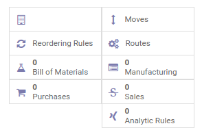 

Tombol-tombol yang berfungsi sebagai *Shortcut* untuk masuk ke dalam menu yang berkaitan dan juga sebagai pemberi informasi mengenai seberapa banyak data, total, dll  

### <a name="bagian-information">TAB INFORMATION</a>

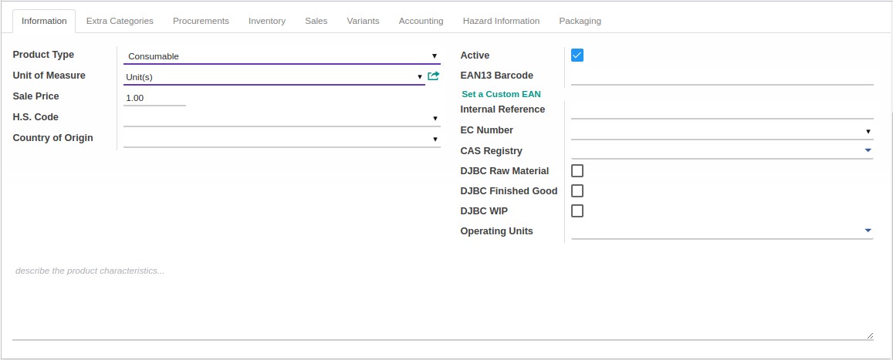

#### <a name="bagian-information-field-type">Product Type</a>

Mendefinisikan tipe produk. Tipe produk dibagi atas beberapa pilihan, yaitu:  
* **Stockable Product:** Produk yang berbentuk barang dan akan disimpan sebagai stock
* **Consumable:** Produk yang kebutuhannya untuk dikonsumsi
* **Service:** Produk yang berbentuk jasa

#### <a name="bagian-information-field-uom-id">Unit of Measure</a>

Mendefinisikan satuan yang akan digunakan

#### <a name="bagian-information-field-list-price">Sale Price</a>

Menentukan harga/nilai jual dari produk

#### <a name="bagian-information-field-hs-code-id">H.S Code</a>
> **Catatan:** (Inggris: *Harmonised System* Code disingkat H.S Code)

Mendefiniskan H.S Code dari produk

#### <a name="bagian-information-field-origin-country-id">Country of Origin</a>

Daerah asal pembuatan produk

#### <a name="bagian-information-field-active">Active</a>

Sebagai penanda apakah data adalah aktif/non-aktif

#### <a name="bagian-information-field-ean13">EAN13 Barcode</a>

Mendefinisikan barcode bertipe EAN13 untuk produk.
Barcode dapat digenerate secara otomati dengan mengklik tombol **Set a Custom EAN**

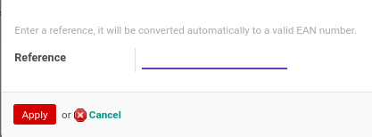
* **Reference:** Referensi yang akan digunakan untuk mengenerate EAN13 Barcode secara otomatis

#### <a name="bagian-information-field-default-code">Internal Reference</a>

Mendefinisikan referensi produk yang hanya akan digunakan oleh pihak internal

#### <a name="bagian-information-field-ec-number-id">EC Number</a>
> **Catatan:** (Inggris: *European Community* number disingkat EC number)

Mendefiniskan EC Number dari produk

#### <a name="bagian-information-field-cas-registry-ids">CAS Registry</a>
> **Catatan:** (Inggris: *Chemical Abstracts Service* registry disingkat CAS Registry)

Mendefiniskan CAS Registry dari produk

#### <a name="bagian-information-field-djbc-rm">DJBC RAW Material</a>

Jika dicentang, maka produk akan digunakan sebagai DJBC Raw Material

#### <a name="bagian-information-field-djbc-fg">DJBC Finished Good</a>

Jika dicentang, maka produk akan digunakan sebagai DJBC Finished Good

#### <a name="bagian-information-field-djbc-wip">DJBC WIP</a>

Jika dicentang, maka produk akan digunakan sebagai DJBC WIP

#### <a name="bagian-information-field-operating-unit-ids">Operating Units</a>
> **Catatan:** Isian ini hanya untuk user yang memiliki group **Multi Operating Unit**

Mendefinisikan operating unit untuk produk.

#### <a name="bagian-information-field-description">Description</a>

Mendefinisikan deskripsi produk secara detail

### <a name="bagian-extra-categories">TAB EXTRA CATEGORIES</a>

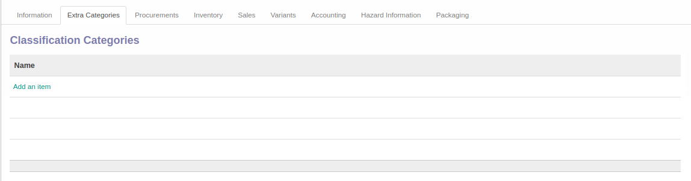

#### <a name="bagian-extra-categories-field-categ-ids">Classification Categories</a>

Mendefinisikan kategori produk tambahan

### <a name="bagian-procurement">TAB PROCUREMENT</a>

Informasi pada Tab Procurement dibagi menjadi beberapa area, diantaranya:

* [Costing](#bagian-procurement-costing)
* [Purchase](#bagian-procurement-purchase)
* [Supply Chain Information](#bagian-procurement-supply-chain-info)
* [Manufacturer](#bagian-procurement-manufacturer)
* [Suppliers](#bagian-procurement-suppliers)

### <a name="bagian-procurement-costing">Costing</a>

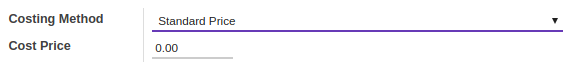

#### <a name="bagian-procurement-field-cost-method">Costing Method</a>

Mendefinisikan metode pembiayaan produk. Metode dibagi atas 3 pilihan, yaitu: 
* **Standard Price:** Metode pembiayaan dimana harga yang digunakan akan tetap (tidak berubah) sampai ada pembaharuan
* **Average Price:** Metode pembiayaan dimana harga akan dihitung secara rata-rata dari barang  yang pertama kali masuk hingga yang terakhir.
* **Real Price:** Metode pembiayaan dimana harga yang digunakan sesuai dengan harga yang masuk

#### <a name="bagian-procurement-field-cost-price">Cost Price</a>

Mendefiniskan harga pembelian

### <a name="bagian-procurement-purchase">Purchase</a>

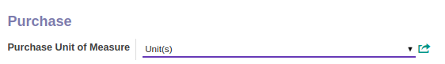

#### <a name="bagian-procurement-field-uom-po-id">Purchase Unit of Measure</a>

Mendefiniskan satuan yang akan digunakan produk saat melakukan pembelian

### <a name="bagian-procurement-supply-chain-info">Supply Chain Information</a>

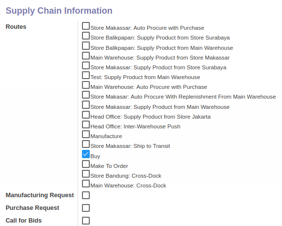

#### <a name="bagian-procurement-field-route-ids">Routes</a>

Mendefiniskan rute pergerakan produk

#### <a name="bagian-procurement-field-mrp-production-request">Manufacturing Request</a>

#TODO

#### <a name="bagian-procurement-field-purchase-request">Purchase Request</a>

#TODO

#### <a name="bagian-procurement-field-purchase-requesition">Call for Bids</a>

#TODO

### <a name="bagian-procurement-manufacturer">Manufacturer</a>

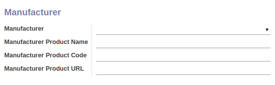

#### <a name="bagian-procurement-field-manufacturer">Manufacturer</a>

Mendefinisikan pabrikan dari produk

#### <a name="bagian-procurement-field-manufacturer-pname">Manufacturer Product Name</a>

Mendefinisikan nama produk yang berasal dari pabrikan

#### <a name="bagian-procurement-field-manufacturer-pcode">Manufacturer Product Code</a>

Mendefinisikan kode produk yang berasal dari pabrikan

#### <a name="bagian-procurement-field-manufacturer-purl">Manufacturer Product URL</a>

Mendefinisikan alamat URL produk yang berasal dari pabrikan

### <a name="bagian-procurement-suppliers">Suppliers</a>

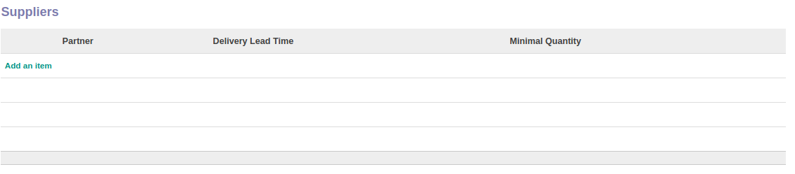
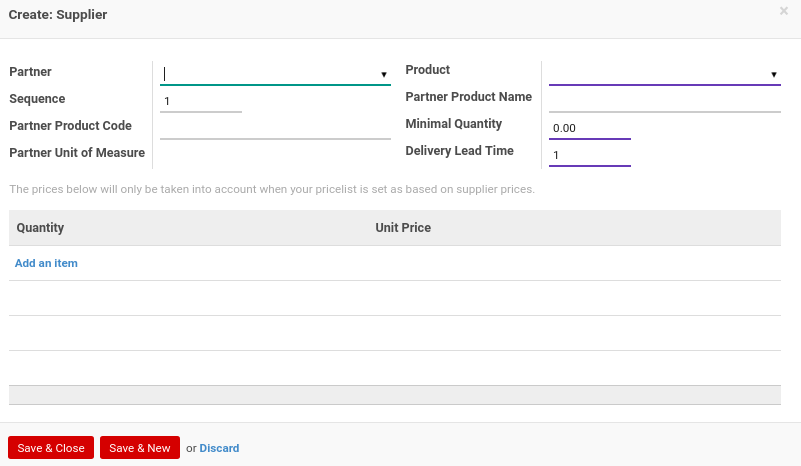

#### <a name="bagian-procurement-supplier-field-name">Partner</a>

Mendefinisikan supplier dari produk

#### <a name="bagian-procurement-supplier-field-sequence">Sequence</a>

No. Urut

#### <a name="bagian-procurement-supplier-field-product-code">Partner Product Code</a>

Mendefinisikan kode produk yang diberikan oleh supplier

#### <a name="bagian-procurement-supplier-field-product-uom">Partner Unit of Measure</a>

Mendefinisikan satuan produk yang diberikan oleh supplier

#### <a name="bagian-procurement-supplier-field-product-tmpl-id">Product</a>

Mendefinisikan produk

#### <a name="bagian-procurement-supplier-field-product-code">Partner Product Name</a>

Mendefinisikan nama produk yang diberikan oleh supplier

#### <a name="bagian-procurement-supplier-field-min-qty">Minimal Quantity</a>

Mendefinisikan minimal kuantiti produk

#### <a name="bagian-procurement-supplier-field-delay">Delivery Lead Time</a>

#TODO

#### <a name="bagian-procurement-supplier-field-pricelist-min-qty">Quantity</a>

#TODO

#### <a name="bagian-procurement-supplier-field-pricelist-unit-price">Unit Price</a>

#TODO

#### <a name="bagian-procurement-field-description">Description</a>

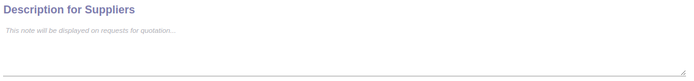

Mendefinisikan deskripsi supplier secara detail

### <a name="bagian-inventory">TAB INVENTORY</a>

Informasi pada Tab Inventory dibagi menjadi beberapa area, diantaranya:

* [Stock and Expected Variations](#bagian-inventory-stock-expected-variations)
* [Lots](#bagian-inventory-lots)
* [Status](#bagian-inventory-status)
* [Storage Location](#bagian-inventory-storage-location)
* [Counter-Part Locations Properties](#bagian-inventory-counterpart-location)
* [Weights](#bagian-inventory-weight)
* [Dates](#bagian-inventory-dates)
* [RMA](#bagian-inventory-rma)
* [Packaging](#bagian-inventory-packaging)
* [Quality Control](#bagian-inventory-quality-control)

### <a name="bagian-inventory-stock-expected-variations">Stock and Expected Variations</a>

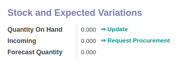

#### <a name="bagian-inventory-field-qty-available">Quantity On Hand</a>

Informasi total ketersediaan barang yang ada di gudang.
Informasi ini dapat di-*update* nilainy dengan mengklik tombol **Update**

#### <a name="bagian-inventory-field-incoming-qty">Incoming</a>

Informasi total barang yang akan masuk.
User dapat mengklik tombol **Request Procurement** untuk langsung melakukan permintaan pengadaan barang
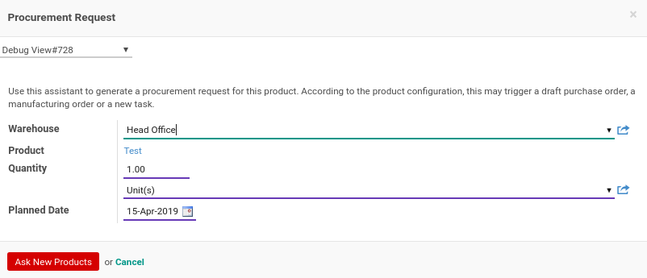

* **Warehouse:** Mendefinisikan gudang 
* **Product:** Mendefinisikan produk. Isian ini akan diisi otomatis oleh sistem dan tidak dapat diganti
* **Quantity:** Mendefinisikan banyaknya kuantiti dan satuan produk yang diminta untuk pengadaan barang
* **Planned Date:** Menentukan tanggal perencanaan untuk permintaan pengadaan barang

#### <a name="bagian-inventory-field-qty-available">Forecast Quantity</a>

Informasi total perkiraan produk yang tersedia.

### <a name="bagian-inventory-lots">Lots</a>

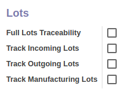

#### <a name="bagian-inventory-lots-field-track-all">Full Lots Traceability</a>

Jika dicentang, maka produk ini diwajibkan memiliki serial number untuk setiap pergerakan stock(Masuk, Keluar, Produksi)

#### <a name="bagian-inventory-lots-field-track-incoming">Track Incoming Lots</a>

Jika dicentang, maka produk ini diwajibkan memiliki serial number untuk setiap pergerakan stock masuk

#### <a name="bagian-inventory-lots-field-track-outgoing">Track Outgoing Lots</a>

Jika dicentang, maka produk ini diwajibkan memiliki serial number untuk setiap pergerakan stock keluar

#### <a name="bagian-inventory-lots-field-track-production">Track Manufacturing Lots</a>

Jika dicentang, maka produk ini diwajibkan memiliki serial number untuk setiap pergerakan stock produksi

> **Catatan:** Isian *Track Incoming Lots*, *Track Outgoing Lots* dan *Track Manufacturing Lots* hanya dapat diisi apabila *Full Lots Traceability* tidak dicentang

### <a name="bagian-inventory-status">Status</a>

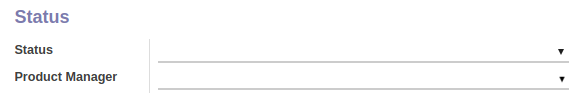

#### <a name="bagian-inventory-status-field-state">Status</a>

Mendefinisikan status. Status dibagi atas beberapa pilihan, yaitu:
* **In Development:** #TODO
* **Normal:** #TODO
* **End of Lifecycle:** #TODO
* **Obsolote:** #TODO

#### <a name="bagian-inventory-status-field-product-manager">Product Manager</a>

Mendefinisikan manajer produk

### <a name="bagian-inventory-storage-location">Storage Location</a>

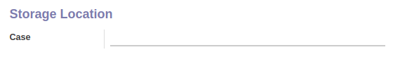

#### <a name="bagian-inventory-storage-location-field-case">Case</a>

#TODO

### <a name="bagian-inventory-counterpart-location">Counter-Part Locations Properties</a>

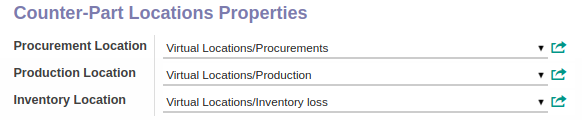

#### <a name="bagian-inventory-counterpart-location-field-property-stock-procurement">Procurement Location</a>

Mendefinisikan lokasi *Procurement*

#### <a name="bagian-inventory-counterpart-location-field-property-stock-production">Production Location</a>

Mendefinisikan lokasi *Production*

#### <a name="bagian-inventory-counterpart-location-field-property-stock-inventory">Inventory Location</a>

Mendefinisikan lokasi *Inventory*

### <a name="bagian-inventory-weight">Weights</a>

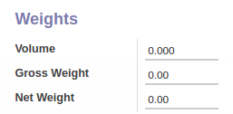

#### <a name="bagian-inventory-weight-field-volume">Volume</a>

Mendefinisikan volume produk

#### <a name="bagian-inventory-weight-field-weight">Gross Weight</a>

Mendefinisikan berat kotor produk

#### <a name="bagian-inventory-weight-field-weight-net">Net Weight</a>

Mendefinisikan berat bersih produk

### <a name="bagian-inventory-dates">Dates</a>

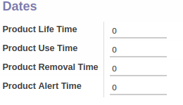

#### <a name="bagian-inventory-dates-field-life-time">Product Life Time</a>

Mendefinisikan berapa hari masa kadularsa produk

#### <a name="bagian-inventory-dates-field-use-time">Product Use Time</a>

Mendefinisikan berapa hari layak pakai produk

#### <a name="bagian-inventory-dates-field-removal-time">Product Removal Time</a>

Mendefinisikan berapa hari produk harus dibuang dari gudang

#### <a name="bagian-inventory-dates-field-removal-time">Product Alert Time</a>

#TODO

### <a name="bagian-inventory-rma">RMA</a>

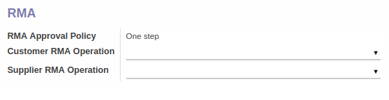

#### <a name="bagian-inventory-rma-field-rma-approval-policy">RMA Approval Policy</a>

#TODO

#### <a name="bagian-inventory-rma-field-rma-customer-operation-id">Customer RMA Operation</a>

#TODO

#### <a name="bagian-inventory-rma-field-rma-supplier-operation-id">Supplier RMA Operation</a>

#TODO

### <a name="bagian-inventory-packaging">Packaging</a>

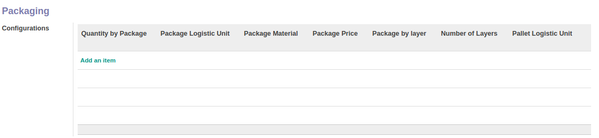
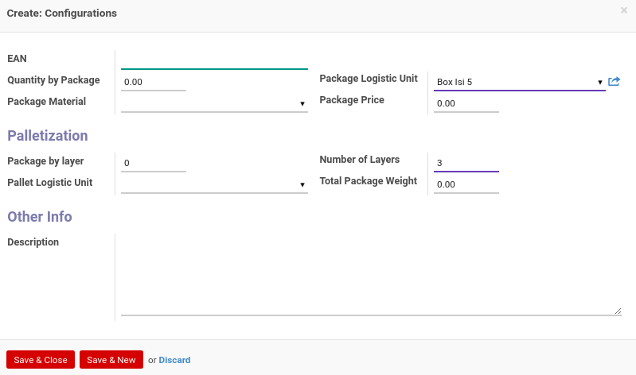

#### <a name="bagian-inventory-packaging-field-ean">EAN</a>

Mendefiniskan kode EAN untuk packaging

#### <a name="bagian-inventory-packaging-field-qty">Quantity by Package</a>

Mendefiniskan jumlah kuantiti untuk packaging

#### <a name="bagian-inventory-packaging-field-package-material-id">Package Material</a>

Mendefiniskan material yang digunakan untuk packaging

#### <a name="bagian-inventory-packaging-field-ul">Package Logistic Unit</a>

#TODO

#### <a name="bagian-inventory-packaging-field-list-price">Package Price</a>

Mendefiniskan harga packaging

#### <a name="bagian-inventory-packaging-field-ul-qty">Package by layer</a>

#TODO

#### <a name="bagian-inventory-packaging-field-ul-container">Pallet Logistic Unit</a>

#TODO

#### <a name="bagian-inventory-packaging-field-rows">Number of Layers</a>

#TODO

#### <a name="bagian-inventory-packaging-field-weights">Total Package Weight</a>

Mendefiniskan berat total dari packaging

#### <a name="bagian-inventory-packaging-field-name">Description</a>

Mendefiniskan deskripsi packaging

### <a name="bagian-inventory-quality-control">Quality Control</a>

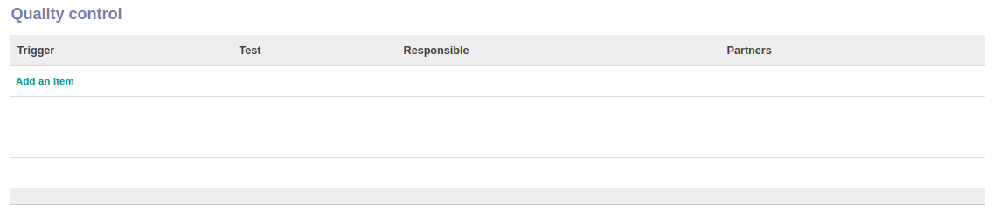

#### <a name="bagian-inventory-quality-control-field-trigger">Trigger</a>

#TODO

#### <a name="bagian-inventory-quality-control-field-test">Test</a>

#TODO

#### <a name="bagian-inventory-quality-control-field-responsible">Responsible</a>

Mendefinisikan siapa yang akan bertanggun jawab atas Quality Control

#### <a name="bagian-inventory-quality-control-field-partner-id">Partners</a>

#TODO

### <a name="bagian-sales">TAB SALES</a>

Informasi pada Tab Sales dibagi menjadi beberapa area, diantaranya:

* [Sale Conditions](#bagian-sales-conditions)
* [Unit of Measure](#bagian-sales-uom)
* [Point of Sale](#bagian-sales-pos)
* [Website](#bagian-sale-website)
* [Customers](#bagian-sales-customers)

### <a name="bagian-sales-conditions">Sale Conditions</a>

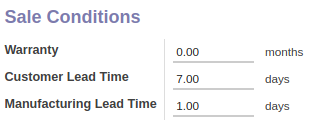

#### <a name="bagian-sales-conditions-field-warranty">Warranty</a>

Mendefinisikan masa garansi produk

#### <a name="bagian-sales-conditions-field-sale-delay">Customer Lead Time</a>

#TODO

#### <a name="bagian-sales-conditions-field-produce-delay">Manufacturing Lead Time</a>

#TODO

### <a name="bagian-sales-uom">Unit of Measure</a>

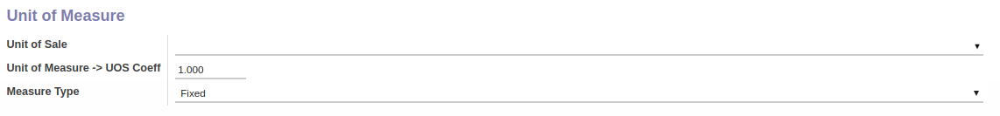

#### <a name="bagian-sales-uom-field-uos-id">Unit of Sale</a>

#TODO

#### <a name="bagian-sales-uom-field-uos-coeff">Unit of Measure -> UOS Coeff</a>

#TODO

#### <a name="bagian-sales-uom-field-mess-type">Measure Type</a>

Terbagi atas 2 pilihan, yaitu: 
* **Fixed:**
* **Variable:**

### <a name="bagian-sales-pos">Point of Sale</a>

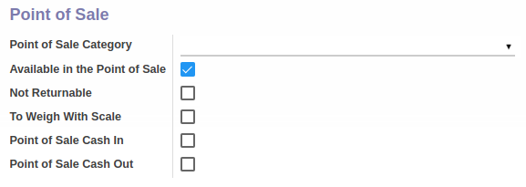

#### <a name="bagian-sales-pos-field-po-categ-id">Point of Sale Category</a>

Mendefinisikan kategori dari PoS

#### <a name="bagian-sales-pos-field-available-in-pos">Available in the Point of Sale</a>

Jika dicentang, maka produk akan tersedia pada PoS

#### <a name="bagian-sales-pos-field-not-returnable">Not Returnable</a>

Jika dicentang, maka produk tidak bisa dikembalikan

#### <a name="bagian-sales-pos-field-to-weight">To Weigh With Scale</a>

Jika dicentang, maka produk diwajibkan untuk ditimbang terlebih dahulu menggunakan timbangan yang sudah terintegrasi langsung

#### <a name="bagian-sales-pos-field-income-pdt">Point of Sale Cash In</a>

#TODO

#### <a name="bagian-sales-pos-field-income-pdt">Point of Sale Cash Out</a>

#TODO

### <a name="bagian-sales-website">Website</a>

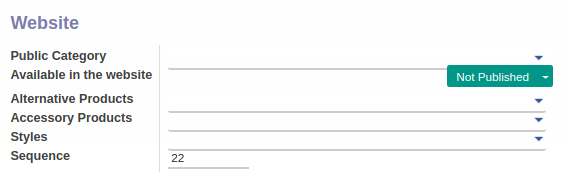

#### <a name="bagian-sales-website-field-public-categ-ids">Public Category</a>

Mengkategorikan produk yang hampir sama untuk kebutuhan e-commerce

#### <a name="bagian-sales-website-field-website-published">Available in the website</a>

* **Not Published:** Produk tidak akan dipublikasikan pada halaman website
* **Published:** Produk tidak akan dipublikasikan pada halaman website

#### <a name="bagian-sales-website-field-alternative-product-ids">Alternative Products</a>

#TODO

#### <a name="bagian-sales-website-field-acc-product-ids">Accessory Products</a>

#TODO

#### <a name="bagian-sales-website-field-website-style-ids">Styles</a>

#TODO

#### <a name="bagian-sales-website-field-website-sequence">Sequence</a>

Mendefinisikan kode sequence

### <a name="bagian-sales-customers">Customers</a>

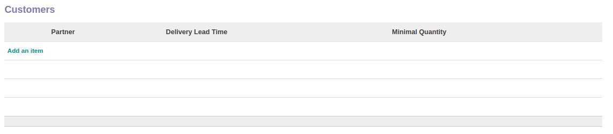
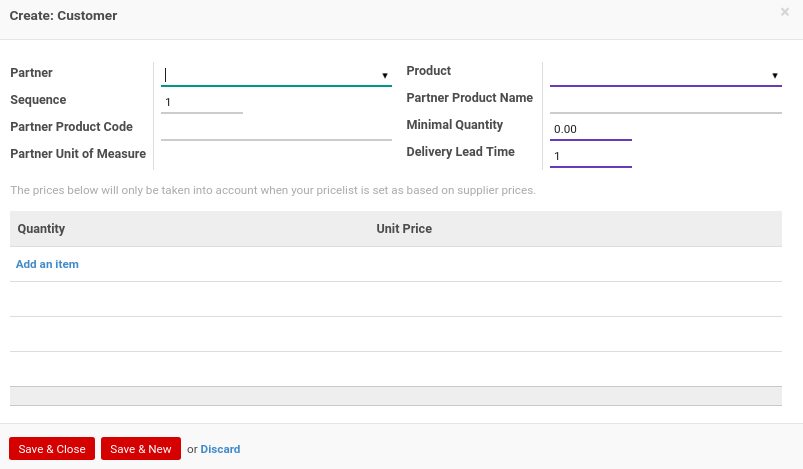

#### <a name="bagian-procurement-customers-field-name">Partner</a>

Mendefinisikan konsumen

#### <a name="bagian-procurement-customers-field-sequence">Sequence</a>

No. Urut

#### <a name="bagian-procurement-customers-field-product-code">Partner Product Code</a>

Mendefinisikan kode produk yang diberikan oleh supplier

#### <a name="bagian-procurement-supplier-field-product-uom">Partner Unit of Measure</a>

Mendefinisikan satuan produk yang diberikan oleh supplier

#### <a name="bagian-procurement-supplier-field-product-tmpl-id">Product</a>

Mendefinisikan produk

#### <a name="bagian-procurement-supplier-field-product-code">Partner Product Name</a>

Mendefinisikan nama produk yang diberikan oleh supplier

#### <a name="bagian-procurement-supplier-field-min-qty">Minimal Quantity</a>

Mendefinisikan minimal kuantiti produk

#### <a name="bagian-procurement-supplier-field-delay">Delivery Lead Time</a>

#TODO

#### <a name="bagian-procurement-supplier-field-pricelist-min-qty">Quantity</a>

#TODO

#### <a name="bagian-procurement-supplier-field-pricelist-unit-price">Unit Price</a>

#TODO

#### <a name="bagian-sales-field-description">Description for Quotations</a>

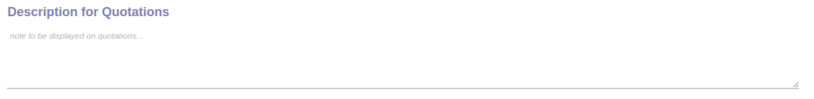

Mendefinisikan deskripsi quotations secara detail

### <a name="bagian-variants">TAB VARIANTS</a>

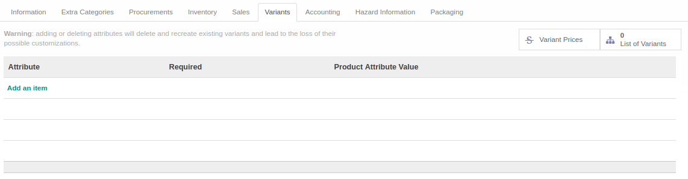

#### <a name="bagian-variants-field-smart-button">Smart Button</a>

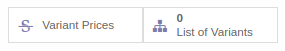 

Tombol-tombol yang berfungsi sebagai *Shortcut* untuk masuk ke dalam menu yang berkaitan dan juga sebagai pemberi informasi mengenai seberapa banyak data, total, dll  

#### <a name="bagian-variants-field-attribute-id">Attribute</a>

Mendefinisikan attribut yang diperlukan untuk variasi produk

#### <a name="bagian-variants-field-required">Required</a>

Jika dicentang, maka akan bersifat wajib diisi

#### <a name="bagian-variants-field-value-ids">Product Attribute Value</a>

Mendefinisikan value dari attribut produk yang dipilih

### <a name="bagian-accounting">TAB ACCOUNTING</a>

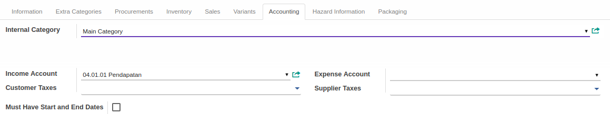

#### <a name="bagian-accounting-field-categ-id">Internal Category</a>

#TODO

#### <a name="bagian-accounting-field-property-account-income">Income Account</a>

Mendefinisikan akun pemasukan untuk produk

#### <a name="bagian-accounting-field-property-account-expense">Expense Account</a>

Mendefinisikan akun pengeluaran untuk produk

#### <a name="bagian-accounting-field-taxes-id">Customer Taxes</a>

Mendefinisikan pajak yang akan dikenakan terhadap konsumen

#### <a name="bagian-accounting-field-supplier-taxes-id">Supplier Taxes</a>

Mendefinisikan pajak yang akan dikenakan terhadap supplier

#### <a name="bagian-accounting-field-must-have-dates">Must Have Start and End Dates</a>

Jika dicentang, maka produk ini wajib memiliki tanggal mulai dan akhir pada invoice line

### <a name="bagian-hazard-information">TAB HAZARD INFORMATION</a>

Informasi pada Tab Hazard Information dibagi menjadi beberapa area, diantaranya:

* [Hazard Statement](#bagian-hazard-statement)
* [Hazard Precautionary Statement](#bagian-hazard-precautionary)
* [Hazard Pictogram](#bagian-hazard-pictogram)

### <a name="bagian-hazard-statement">Hazard Statement</a>

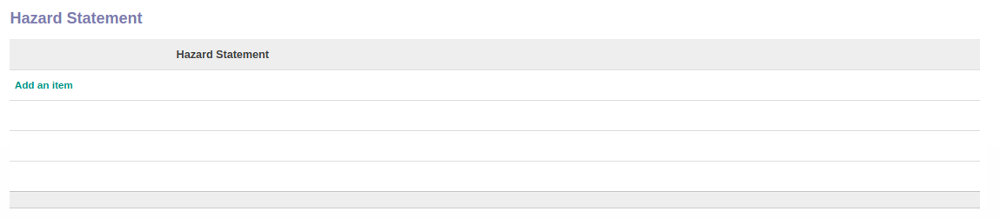

#### <a name="bagian-hazard-statement-field-hazard-statement-id">Hazard Statement</a>

Mendefinisikan pernyataan bahaya terkait produk

### <a name="bagian-hazard-precautionary">Hazard Precautionary Statement</a>

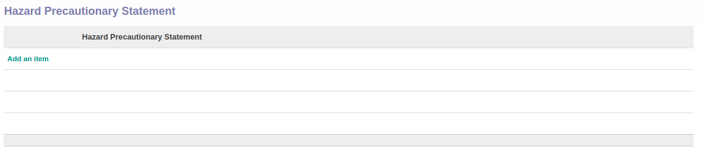

#### <a name="bagian-hazard-statement-field-hazard-precautionary-statement-id">Hazard Precautionary Statement</a>

Mendefinisikan pernyataan pencegahan bahaya terkait produk

### <a name="bagian-hazard-pictogram">Hazard Pictogram</a>

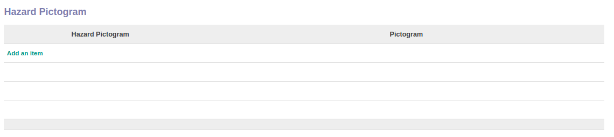

#### <a name="bagian-hazard-statement-field-hazard-pictogram-id">Hazard Pictogram</a>

Mendefinisikan pictogram dari pernyataan pencegahan bahaya terkait produk

### <a name="bagian-packaging">TAB PACKAGING</a>

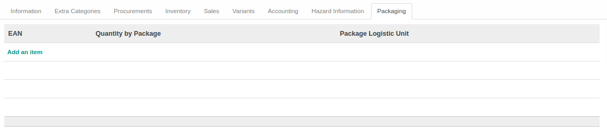
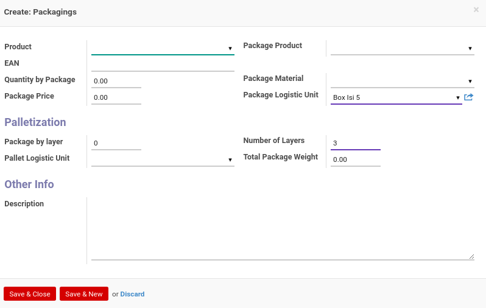

#### <a name="bagian-packaging-field-product-tmpl-id">Product</a>

#TODO

#### <a name="bagian-inventory-packaging-field-ean">EAN</a>

Mendefiniskan kode EAN untuk packaging

#### <a name="bagian-inventory-packaging-field-qty">Quantity by Package</a>

Mendefiniskan jumlah kuantiti untuk packaging

#### <a name="bagian-inventory-packaging-field-list-price">Package Price</a>

Mendefiniskan harga packaging

#### <a name="bagian-packaging-field-product-tmpl-id">Package Product</a>

#TODO

#### <a name="bagian-inventory-packaging-field-package-material-id">Package Material</a>

Mendefiniskan material yang digunakan untuk packaging

#### <a name="bagian-inventory-packaging-field-ul">Package Logistic Unit</a>

#TODO

#### <a name="bagian-inventory-packaging-field-ul-qty">Package by layer</a>

#TODO

#### <a name="bagian-inventory-packaging-field-ul-container">Pallet Logistic Unit</a>

#TODO

#### <a name="bagian-inventory-packaging-field-rows">Number of Layers</a>

#TODO

#### <a name="bagian-inventory-packaging-field-weights">Total Package Weight</a>

Mendefiniskan berat total dari packaging

#### <a name="bagian-inventory-packaging-field-name">Description</a>

Mendefiniskan deskripsi packaging